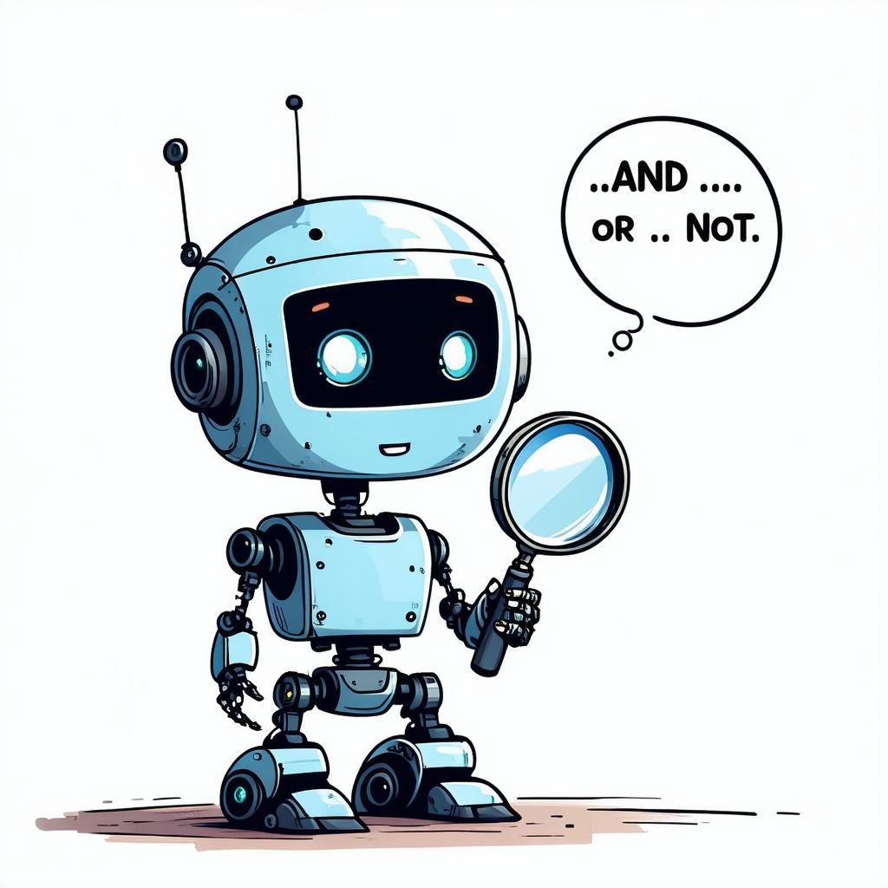

<div align="center">

</div>

# BoolQuestions: Does Dense Retrieval Understand Boolean Logic in Language?

Official repository for [BoolQuestions: Does Dense Retrieval Understand Boolean Logic in Language?](https://aclanthology.org/2024.findings-emnlp.156/)

* **GitHub Repository**: [https://github.com/zmzhang2000/boolean-dense-retrieval](https://github.com/zmzhang2000/boolean-dense-retrieval)

* **HuggingFace Hub**: [https://huggingface.co/datasets/ustc-zhangzm/BoolQuestions](https://huggingface.co/datasets/ustc-zhangzm/BoolQuestions)

* **Paper**: [https://aclanthology.org/2024.findings-emnlp.156](https://aclanthology.org/2024.findings-emnlp.156)

## BoolQuestions

`BoolQuestions` has been uploaded to `Hugging Face Hub`. You can download the dataset from dataset repository [`ustc-zhangzm/BoolQuestions`](https://huggingface.co/datasets/ustc-zhangzm/BoolQuestions) or load with `datasets` library as follows:

```python
from datasets import load_dataset

# BoolQuestions-MSMARCO
dataset = load_dataset("ustc-zhangzm/BoolQuestions", "MSMARCO", split="eval")
corpus = load_dataset("ustc-zhangzm/BoolQuestions", "MSMARCO-corpus", split="corpus")

# BoolQuestions-NaturalQuestions
dataset = load_dataset("ustc-zhangzm/BoolQuestions", "NaturalQuestions", split="eval")
corpus = load_dataset("ustc-zhangzm/BoolQuestions", "NaturalQuestions-corpus", split="corpus")
```

> Note: The dataset is generated by large language models and may contain some noise. We recommend using the dataset for research purposes only.

## Evaluation

We provide the code for evaluating popular dense retrieval models on `BoolQuestions` in our [GitHub repository](https://github.com/zmzhang2000/boolean-dense-retrieval)

First, make sure you have installed `conda` on your machine and install the required packages by running the following command:
```shell
conda create -n bdr python=3.10.13 
conda activate bdr
conda install pytorch==2.1.0 pytorch-cuda=12.1 faiss-gpu -c pytorch -c nvidia
pip install sentence-transformers==3.0.0 datasets==3.1.0
```

Then run the following command to evaluate these models:
```shell
git clone https://github.com/zmzhang2000/boolean-dense-retrieval.git
cd boolean-dense-retrieval
bash evaluate.sh
```

## License

The dataset is Distributed under the CC BY-SA 3.0 license.

## Citation
Please cite the following paper if you find this work helpful for your research
```
@inproceedings{zhang-etal-2024-boolquestions,
    title = "{B}ool{Q}uestions: Does Dense Retrieval Understand {B}oolean Logic in Language?",
    author = "Zhang, Zongmeng  and
      Zhu, Jinhua  and
      Zhou, Wengang  and
      Qi, Xiang  and
      Zhang, Peng  and
      Li, Houqiang",
    editor = "Al-Onaizan, Yaser  and
      Bansal, Mohit  and
      Chen, Yun-Nung",
    booktitle = "Findings of the Association for Computational Linguistics: EMNLP 2024",
    month = nov,
    year = "2024",
    address = "Miami, Florida, USA",
    publisher = "Association for Computational Linguistics",
    url = "https://aclanthology.org/2024.findings-emnlp.156",
    pages = "2767--2779",
}
```